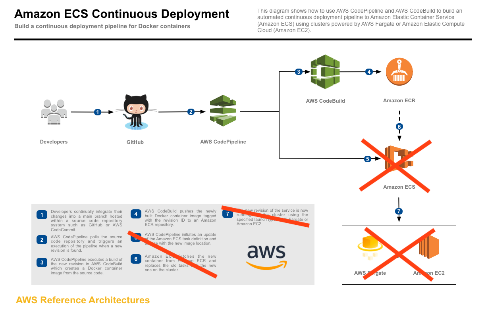

# CI Build Reference Architecture: Continuous Integration

The CI Build reference architecture demonstrates how to achieve
[continuous deployment][continuous-deployment] of an application to ECR or
Docker Hub using AWS CodePipeline and AWS CodeBuild. With this solution for
continuous integration, docker images are prepared for any other separate
process which handles making the entire software release process automated.

Launching this AWS CloudFormation stack provisions a continuous integration
process that uses AWS CodePipeline to monitor a GitHub repository for new
commits and AWS CodeBuild to create a new Docker container image and to push it
into Amazon Elastic Container Registry (Amazon ECR).

You should have a plan for managing the deployed resources, this reference
architecture provides a unique tag for each image build and is made to be
compatible with solutions like [FluxCD](https://github.com/fluxcd/flux).

[][architecture]

## Running the example

#### 1. Fork the GitHub repository

[Fork](https://help.github.com/articles/fork-a-repo/) the [Amazon ECS sample
app](https://github.com/awslabs/ecs-demo-php-simple-app) GitHub repository into
your GitHub account.

From your terminal application, execute the following command (make sure to
replace `<your_github_username>` with your actual GitHub username):

```console
git clone https://github.com/<your_github_username>/demorailsapp
```

This creates a directory named `demorailsapp` in your current directory, which
contains the code for an example containerized Rails app, thanks to Bitnami.

#### 2. Create the CloudFormation stack

Deploy | Region Name | Region | Launch Types
:---: | ------------ | ------------- | -------------
[🚀][us-east-1] | US East (N. Virginia) | us-east-1 | Fargate, EC2
[🚀][us-east-2] | US East (Ohio) | us-east-2 | EC2
[🚀][us-west-1] | US West (N. California) | us-west-1 | EC2
[🚀][us-west-2] | US West (Oregon) | us-west-2 | EC2
[🚀][eu-west-1] | EU (Ireland) | eu-west-1 | EC2
[🚀][eu-west-2] | EU (London) | eu-west-2 | EC2
[🚀][eu-central-1] | EU (Frankfurt) | eu-central-1 | EC2
[🚀][ap-southeast-1] | Asia Pacific (Singapore) | ap-southeast-1 | EC2
[🚀][ap-southeast-2] | Asia Pacific (Sydney) | ap-southeast-2 | EC2
[🚀][ap-northeast-1] | Asia Pacific (Tokyo) | ap-northeast-1 | EC2
[🚀][ap-northeast-2] | Asia Pacific (Seoul) | ap-northeast-2 | EC2
[🚀][ca-central-1] | Canada (Central) | ca-central-1 | EC2

This reference architecture can only be deployed to Regions which have all
necessary services available. See the [Region
Table](https://aws.amazon.com/about-aws/global-infrastructure/regional-product-services/)
for information about service availability.

The CloudFormation template requires the following parameters:

- GitHub Configuration
  - **Repo**: The repo name of the sample service.
  - **Branch**: The branch of the repo to deploy continuously.
  - **User**: Your username on GitHub.
  - **Deploy Token**: Token for the repo specified above.
    ([github.com/<user>/demorailsapp/settings/keys](https://github.com/kingdonb/demorailsapp/settings/keys))

The CloudFormation stack provides the following output:

- **PipelineUrl**: The continuous deployment pipeline in the AWS Management
  Console.

### Testing the example

After the CloudFormation stack is created, the latest commit to the GitHub
repository is run through the pipeline and deployed to ECS. Open the
**PipelineUrl** to watch the first revision run through the CodePipeline
pipeline. After the deploy step turns green, then take the image and deploy it
to your cluster manually (or set up GitOps and automate your deploys!):

* Awesome GitOps [Link](https://github.com/weaveworks/awesome-gitops)
* Helm Operator Get Started [Link](https://github.com/fluxcd/helm-operator-get-started)
* Flux: The GitOps Kubernetes Operator [Link](https://github.com/fluxcd/flux)

To test continuous deployment, make a change to app/views/whatever in the
demorailsapp repository and push it to GitHub. CodePipeline detects
the change, builds the new application, and deploys it to your cluster
automatically. After the pipeline finishes deploying the revision, reload the
page to see the changes made.

### Cleaning up the example resources

To remove all resources created by this example, do the following:

1. Delete the main CloudFormation stack which deletes the substacks and resources.
1. Manually delete resources which may contain content:

    - S3 Bucket: ArtifactBucket
    - ECR Repository: Repository

## CloudFormation template resources

The following sections explains all of the resources created by the
CloudFormation template provided with this example.

#### [DeploymentPipeline](templates/deployment-pipeline.yaml)

  Resources that compose the build pipeline include the CodeBuild project, the
  CodePipeline pipeline, an S3 bucket for deployment artifacts, an ECR repo for
  the sample application, and all necessary IAM roles used by those services.

## License

This reference architecture sample is [licensed][license] under Apache 2.0.

[continuous-deployment]: https://aws.amazon.com/devops/continuous-delivery/
[architecture]: images/architecture.pdf
[license]: LICENSE
[ec2]: https://aws.amazon.com/ec2/
[launch-types]: https://docs.aws.amazon.com/AmazonECS/latest/developerguide/launch_types.html
[us-east-1]: https://console.aws.amazon.com/cloudformation/home?region=us-east-1#/stacks/create/review?stackName=ECS-ContinuousDeployment&templateURL=https://s3.amazonaws.com/kingdonb-refarch-continuous-deployment/kingdonb-refarch-continuous-deployment.yaml
[us-east-2]: https://console.aws.amazon.com/cloudformation/home?region=us-east-2#/stacks/create/review?stackName=ECS-ContinuousDeployment&templateURL=https://s3.amazonaws.com/kingdonb-refarch-continuous-deployment/kingdonb-refarch-continuous-deployment.yaml
[us-west-1]: https://console.aws.amazon.com/cloudformation/home?region=us-west-1#/stacks/create/review?stackName=ECS-ContinuousDeployment&templateURL=https://s3.amazonaws.com/kingdonb-refarch-continuous-deployment/kingdonb-refarch-continuous-deployment.yaml
[us-west-2]: https://console.aws.amazon.com/cloudformation/home?region=us-west-2#/stacks/create/review?stackName=ECS-ContinuousDeployment&templateURL=https://s3.amazonaws.com/kingdonb-refarch-continuous-deployment/kingdonb-refarch-continuous-deployment.yaml
[eu-west-1]: https://console.aws.amazon.com/cloudformation/home?region=eu-west-1#/stacks/create/review?stackName=ECS-ContinuousDeployment&templateURL=https://s3.amazonaws.com/kingdonb-refarch-continuous-deployment/kingdonb-refarch-continuous-deployment.yaml
[eu-west-2]: https://console.aws.amazon.com/cloudformation/home?region=eu-west-2#/stacks/create/review?stackName=ECS-ContinuousDeployment&templateURL=https://s3.amazonaws.com/kingdonb-refarch-continuous-deployment/kingdonb-refarch-continuous-deployment.yaml
[eu-central-1]: https://console.aws.amazon.com/cloudformation/home?region=eu-central-1#/stacks/create/review?stackName=ECS-ContinuousDeployment&templateURL=https://s3.amazonaws.com/kingdonb-refarch-continuous-deployment/kingdonb-refarch-continuous-deployment.yaml
[ap-southeast-1]: https://console.aws.amazon.com/cloudformation/home?region=ap-southeast-1#/stacks/create/review?stackName=ECS-ContinuousDeployment&templateURL=https://s3.amazonaws.com/kingdonb-refarch-continuous-deployment/kingdonb-refarch-continuous-deployment.yaml
[ap-southeast-2]: https://console.aws.amazon.com/cloudformation/home?region=ap-southeast-2#/stacks/create/review?stackName=ECS-ContinuousDeployment&templateURL=https://s3.amazonaws.com/kingdonb-refarch-continuous-deployment/kingdonb-refarch-continuous-deployment.yaml
[ap-northeast-1]: https://console.aws.amazon.com/cloudformation/home?region=ap-northeast-1#/stacks/create/review?stackName=ECS-ContinuousDeployment&templateURL=https://s3.amazonaws.com/kingdonb-refarch-continuous-deployment/kingdonb-refarch-continuous-deployment.yaml
[ap-northeast-2]: https://console.aws.amazon.com/cloudformation/home?region=ap-northeast-2#/stacks/create/review?stackName=ECS-ContinuousDeployment&templateURL=https://s3.amazonaws.com/kingdonb-refarch-continuous-deployment/kingdonb-refarch-continuous-deployment.yaml
[ca-central-1]: https://console.aws.amazon.com/cloudformation/home?region=ca-central-1#/stacks/create/review?stackName=ECS-ContinuousDeployment&templateURL=https://s3.amazonaws.com/kingdonb-refarch-continuous-deployment/kingdonb-refarch-continuous-deployment.yaml
